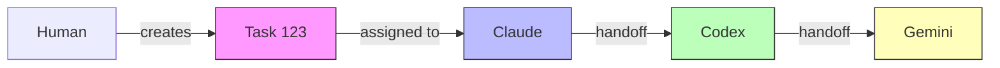

# Call Graph / Tree View for Multi-Tool Collaboration History

**Author:** Claude  
**Date:** 2026-06-21  
**Status:** Evaluation & Design

## Overview

This document evaluates lightweight approaches for visualizing multi-tool collaboration history as a call graph or tree view. The goal is to provide insight into how work flows between tools without heavyweight infrastructure.

## Problem Statement

Current state:
- Radio messages, tasks, workflows exist independently
- Hard to visualize the collaboration flow
- No clear "who called whom" or "who triggered what"
- Difficult to understand handoff sequences
- No visual trace of work delegation chains

Needed:
- Visual representation of tool collaboration
- Call graph showing dependencies
- Timeline view of work progression
- Ability to trace back to origin of work

## Use Cases

### Use Case 1: Debugging Workflow
**Question:** "Why did Codex start working on task X?"

**Answer via Call Graph:**
```
Human → Claude (task create) → Codex (dispatch) → Gemini (review)
```

### Use Case 2: Understanding Handoffs
**Question:** "What's the complete chain of work for feature Y?"

**Answer via Tree View:**
```
└─ Feature Y Implementation
   ├─ Claude: Scope definition (planner)
   ├─ Codex: Implementation (executor)
   │  ├─ Sub-task: API layer
   │  └─ Sub-task: Tests
   └─ Gemini: Code review (reviewer)
```

### Use Case 3: Bottleneck Detection
**Question:** "Where are work items getting stuck?"

**Answer via Timeline:**
```
Claude [========>               ] 30min active
Codex [    waiting...           ] 15min blocked
Gemini[             ======>     ] 10min active
```

## Design Options

### Option 1: Event-Based Call Graph (Lightweight)

**Concept:** Build graph from existing events (radio, task, workflow, handoff)

**Data Sources:**
- Radio messages → communication edges
- Task assignments → ownership edges
- Workflow steps → sequence edges
- Handoff events → transfer edges

**Graph Structure:**
```json
{
  "nodes": [
    { "id": "claude", "type": "tool", "label": "Claude" },
    { "id": "task:123", "type": "work", "label": "Implement feature X" },
    { "id": "codex", "type": "tool", "label": "Codex" }
  ],
  "edges": [
    { "from": "claude", "to": "task:123", "type": "created", "ts": "..." },
    { "from": "task:123", "to": "codex", "type": "assigned", "ts": "..." }
  ]
}
```

**Pros:**
- No new data collection
- Uses existing logs
- Can be rebuilt from history

**Cons:**
- Indirect relationships
- Requires inference
- May miss implicit dependencies

### Option 2: Explicit Call Tracking (Medium Weight)

**Concept:** Track explicit "calls" when one tool invokes another

**Implementation:**
```javascript
// When dispatching work
function dispatchToTool(from, to, workId, reason) {
  appendCallRecord({
    type: 'tool.call',
    from,
    to,
    workId,
    reason,
    ts: new Date().toISOString()
  });
  
  // ... existing dispatch logic
}
```

**Call Record:**
```json
{
  "type": "tool.call",
  "id": "call_abc123",
  "from": "claude",
  "to": "codex",
  "workId": "task:123",
  "reason": "Implementation needed",
  "parentCall": "call_xyz789",
  "ts": "2026-06-21T06:00:00.000Z"
}
```

**Pros:**
- Explicit relationships
- Clear parent/child tracking
- Easy to query

**Cons:**
- Requires code changes
- New storage requirements
- Potential overhead

### Option 3: Tree View from Workflow (Workflow-Specific)

**Concept:** Build tree from workflow execution history

**Workflow Tree:**
```
workflow:lights-out
├─ step:planning (claude) - completed
│  └─ artifact: scope.md
├─ step:implementation (codex) - active
│  ├─ sub-task:api (codex) - completed
│  └─ sub-task:tests (codex) - in-progress
└─ step:review (gemini) - pending
```

**Pros:**
- Natural fit for workflows
- Already structured
- Clear hierarchy

**Cons:**
- Only works for workflows
- Doesn't show ad-hoc work
- Limited to recipe steps

## Recommended Approach: Hybrid Model

Combine event-based inference with explicit tracking where available:

### Phase 1: Event-Based Graph (Immediate)

Build from existing data:

```javascript
function buildCollaborationGraph(memoryDir, options = {}) {
  const { since, project, tools } = options;
  
  const nodes = new Map();
  const edges = [];
  
  // 1. Load radio messages
  const messages = readRadioMessages(memoryDir)
    .filter(m => !since || m.ts >= since)
    .filter(m => !project || m.project === project);
  
  for (const msg of messages) {
    // Add nodes
    addNode(nodes, msg.from, 'tool');
    addNode(nodes, msg.to, 'tool');
    
    // Add edge
    edges.push({
      from: msg.from,
      to: msg.to,
      type: 'message',
      label: msg.type,
      ts: msg.ts
    });
  }
  
  // 2. Load tasks
  const tasks = readTasks(memoryDir)
    .filter(t => !project || t.project === project);
  
  for (const task of tasks) {
    addNode(nodes, task.id, 'task', task.title);
    
    if (task.createdBy) {
      addNode(nodes, task.createdBy, 'tool');
      edges.push({
        from: task.createdBy,
        to: task.id,
        type: 'created',
        ts: task.createdAt
      });
    }
    
    if (task.assignee) {
      addNode(nodes, task.assignee, 'tool');
      edges.push({
        from: task.id,
        to: task.assignee,
        type: 'assigned',
        ts: task.updatedAt
      });
    }
  }
  
  // 3. Load workflows
  const workflows = readWorkflows(memoryDir)
    .filter(w => !project || w.project === project);
  
  for (const workflow of workflows) {
    addNode(nodes, workflow.id, 'workflow', workflow.title);
    
    // Link planner/executor/reviewer
    if (workflow.planner) {
      addNode(nodes, workflow.planner, 'tool');
      edges.push({
        from: workflow.id,
        to: workflow.planner,
        type: 'role:planner',
        ts: workflow.createdAt
      });
    }
    
    if (workflow.executor) {
      addNode(nodes, workflow.executor, 'tool');
      edges.push({
        from: workflow.id,
        to: workflow.executor,
        type: 'role:executor',
        ts: workflow.createdAt
      });
    }
    
    if (workflow.reviewer) {
      addNode(nodes, workflow.reviewer, 'tool');
      edges.push({
        from: workflow.id,
        to: workflow.reviewer,
        type: 'role:reviewer',
        ts: workflow.createdAt
      });
    }
  }
  
  // 4. Load handoff events (if available)
  if (fs.existsSync(path.join(memoryDir, 'handoff', 'transfers.jsonl'))) {
    const handoffs = readHandoffTransfers(memoryDir);
    
    for (const handoff of handoffs) {
      edges.push({
        from: handoff.from,
        to: handoff.to,
        type: 'handoff',
        label: handoff.reason,
        workId: handoff.workId,
        ts: handoff.ts
      });
    }
  }
  
  return {
    nodes: Array.from(nodes.values()),
    edges,
    metadata: {
      generatedAt: new Date().toISOString(),
      since,
      project,
      nodeCount: nodes.size,
      edgeCount: edges.length
    }
  };
}
```

### Phase 2: Explicit Tracking (Future)

Add explicit call tracking in dispatch:

```javascript
// In executeDispatch
function executeDispatch(memoryDir, options) {
  const jobs = buildDispatchJobs(memoryDir, options);
  
  for (const job of jobs) {
    // Record the call
    appendCallRecord(memoryDir, {
      from: getCurrentTool(),
      to: job.tool,
      workId: job.id,
      reason: job.text,
      parentCall: getCurrentCallId()
    });
    
    // ... existing dispatch logic
  }
}
```

## Visualization Options

### Option A: ASCII Tree (CLI)

```bash
ai-memory-hub graph tree --project ai-memory-hub

Feature Implementation (task:123)
├─ Created by: human
├─ Claimed by: claude (planner)
│  ├─ Duration: 15min
│  └─ Output: scope document
├─ Handed off to: codex (executor)
│  ├─ Duration: 45min
│  └─ Output: implementation
└─ Handed off to: gemini (reviewer)
   ├─ Duration: active
   └─ Status: in-progress
```

### Option B: Mermaid Diagram (Markdown)

```bash
ai-memory-hub graph mermaid --project ai-memory-hub > graph.md


```

### Option C: JSON Export (Dashboard)

```bash
ai-memory-hub graph export --project ai-memory-hub --format json > graph.json
```

Dashboard can then render with:
- D3.js force-directed graph
- Cytoscape.js network view
- Vis.js timeline + network

### Option D: Interactive TUI (Terminal)

```bash
ai-memory-hub graph interactive

┌─ Collaboration Graph ─────────────────────────┐
│                                                │
│   ┌──────┐                                    │
│   │Human │                                    │
│   └──┬───┘                                    │
│      │ creates                                │
│   ┌──▼──────┐    handoff   ┌──────────┐      │
│   │Task 123 │─────────────►│  Claude  │      │
│   └─────────┘              └────┬─────┘      │
│                                 │ handoff     │
│                              ┌──▼─────┐       │
│                              │ Codex  │       │
│                              └────┬───┘       │
│                                   │ handoff   │
│                                ┌──▼─────┐     │
│                                │Gemini  │     │
│                                └────────┘     │
│                                                │
│ [F]ilter [T]imeline [E]xport [Q]uit           │
└────────────────────────────────────────────────┘
```

## CLI Commands

```bash
# Show graph as ASCII tree
ai-memory-hub graph tree [--project <name>] [--since <date>]

# Export as mermaid diagram
ai-memory-hub graph mermaid [--project <name>] > diagram.md

# Export as JSON
ai-memory-hub graph export --format json [--project <name>]

# Show interactive graph
ai-memory-hub graph interactive [--project <name>]

# Show timeline view
ai-memory-hub graph timeline [--project <name>]

# Show tool activity
ai-memory-hub graph activity --tool claude [--since 1d]
```

## Storage

### Graph Cache

`<memoryDir>/graph/cache.json` - Pre-computed graph (invalidated on changes):

```json
{
  "version": 1,
  "generatedAt": "2026-06-21T06:00:00.000Z",
  "ttl": 300,
  "graph": {
    "nodes": [...],
    "edges": [...]
  }
}
```

### Call Log (Optional, Phase 2)

`<memoryDir>/graph/calls.jsonl` - Explicit call tracking:

```jsonl
{"type":"tool.call","from":"claude","to":"codex","workId":"task:123","ts":"..."}
{"type":"tool.return","from":"codex","to":"claude","result":"success","ts":"..."}
```

## Performance Considerations

**For large histories:**
- Limit time window (last 24h, last week)
- Limit to specific project
- Cache computed graphs
- Use incremental updates
- Lazy-load details

**For real-time:**
- Subscribe to event streams
- Incremental graph updates
- WebSocket for dashboard

## Benefits

1. **Transparency** - See how work flows between tools
2. **Debugging** - Trace work back to origin
3. **Bottleneck Detection** - Identify stuck handoffs
4. **Audit Trail** - Full collaboration history
5. **Understanding** - Visual representation aids comprehension

## Next Steps

1. ✅ Design evaluation (this document)
2. Implement `buildCollaborationGraph()` function
3. Add CLI commands (`graph tree`, `graph mermaid`)
4. Add dashboard graph visualization
5. (Future) Add explicit call tracking

## See Also

- [Handoff Bus Sync Model](./handoff-bus-sync-model.md)
- [RPC Envelope Design](./rpc-envelope-design.md)
- [Workflow System](../src/index.js#workflows)
- [Radio Messages](../src/index.js#radio)
